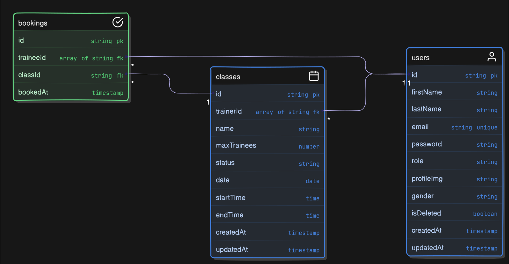

# Gym Class Scheduling and Membership Management System

## Project Overview

This system is designed to manage gym class schedules, bookings, and memberships with role-based access. The system defines three roles: `Admin`, `Trainer`, and `Trainee`, each with specific permissions.

- **Admin**: Responsible for scheduling up to 5 classes per day, managing trainers, and assigning them to classes.
- **Trainer**: Can view their assigned class schedules but cannot manage or create new classes or profiles.
- **Trainee**: Can book classes, manage their profiles, and cancel bookings if needed.

## Business Logic

### Class Scheduling

- **Maximum of 5 classes per day**.
- **Each class lasts for 2 hours**.
- **Maximum of 10 trainees per class**.
- **Once a class reaches its capacity, no further bookings can be made**.
- Admins can schedule new classes and assign trainers.

### Booking System

- **Trainees** can book classes if there is availability (maximum 10 trainees per class).
- **Trainees cannot book multiple classes at the same time**.
- **Trainees can cancel their bookings** if the class has not already started.

## Setup Instructions

1. Clone the repository:

```bash
git clone https://github.com/tanvir1017/class-and-membership-management

cd class-and-membership-management
```

2. Install dependencies:

```bash
npm install
```

3. Create a .env file with the following environment variables:

```bash
NODE_ENV = null
PORT = null
DATABASE_URL = null
BCRYPT_SALT_ROUNDS = null
JWT_ACCESS_TOKEN = null
JWT_REFRESH_TOKEN = null
JWT_ACCESS_EXPIRES_IN = null
JWT_REFRESH_EXPIRES_IN = null
ADMIN_PASSWORD = null
```

## Example Workflow

1. **Login**: Trainee or Admin logs in using their credentials to obtain a JWT token.
2. **Book a Class**: A Trainee can view available classes and book one if there are slots.
3. **Cancel Booking**: A Trainee can cancel their booking as long as the class has not yet started.
4. **Admin Class Scheduling**: Admin schedules a new class, and assigns trainers to the class.

## Database Design


